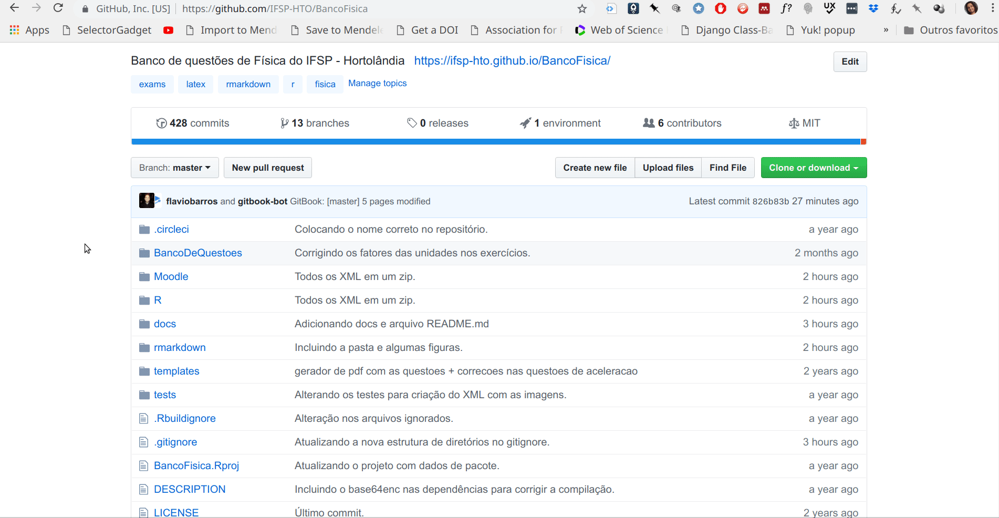

# BancoFísica

[](https://circleci.com/gh/flaviobarros/BancoFisica/tree/master) [](https://opensource.org/licenses/MIT)

## Introdução

Este é o repositório oficial do banco de questões de Física produzido pelos professores do Câmpus Hortolândia. Todas as questões devem ser programadas utilizando o pacote [exams](https://cran.r-project.org/web/packages/exams/index.html) do R. Nas próximas seções do documento podem ser encontradas instruções de como contribuir com o repositório.

A seguir você encontra a documentação de como utilizar questões prontas na plataforma Moodle e como contribuir para o projeto.

## Quickstart

```text
git clone https://github.com/IFSP-HTO/BancoFisica.git pasta
```

Depois basta entrar na pasta e você encontra o código para todas as questões e o código para geração de PDF e HTML.

### Moodle

Caso queira simplesmente utilizar as questões prontas no Moodle, você pode baixar o arquivo [XML.zip](https://github.com/IFSP-HTO/BancoFisica/blob/master/Moodle/XML.zip) em uma pasta do seu computador e descompactar. Você vai encontrar os arquivos em XML compilados para todas as questões disponíveis no banco. Há um arquivo para cada assunto.

```text
XML
    ├── acel-12018.xml
    ├── calorimetria-12018.xml
    ├── calortemp-12018.xml
    ├── dilatterm-12018.xml
    ├── estatica-12018.xml
    ├── hidrostatica-12019.xml
    ├── leidosgases-12018.xml
    ├── leisdenewton-12018.xml
    ├── movcircular-12018.xml
    ├── MU-12018.xml
    ├── ondas-12018.xml
    ├── optica-12018.xml
    ├── termodinamica-12018.xml
    └── trabalhopotencia-12018.xml
```

#### Baixando



#### Banco de Questões

Uma vez baixadas as questões você pode utilizá-las diretamente no Moodle. Mas para isso você deve importar o XML em um banco de questões. Para exemplificar o processo vamos utilizar o [Moodle Sandbox](https://demo.moodle.net/).


Por fim basta criar um questionário a partir do banco de questões.

