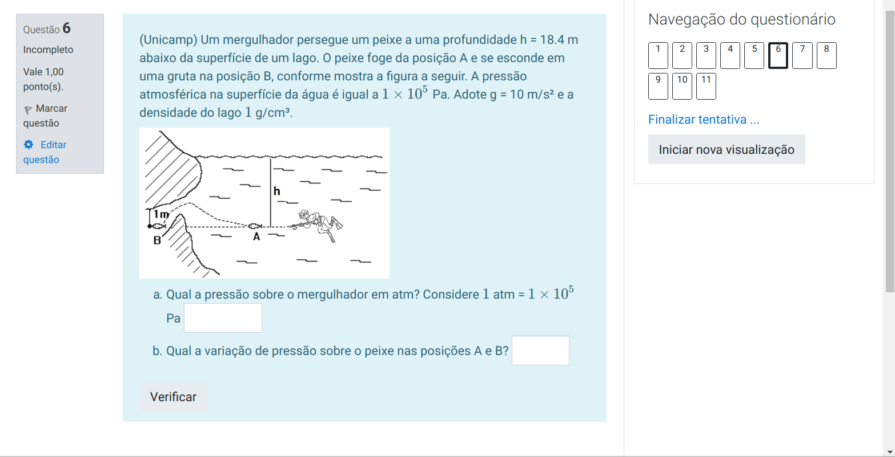

# BancoFísica

[](https://circleci.com/gh/flaviobarros/BancoFisica/tree/master) [](https://opensource.org/licenses/MIT)

## Introdução

Este é o repositório oficial do banco de questões de Física produzido pelos professores do IFSP - Câmpus Hortolândia. Todas as questões devem ser programadas utilizando o pacote [exams](http://www.r-exams.org/) do R. Nas próximas seções do documento podem ser encontradas instruções de como contribuir com o repositório.

A seguir você encontra a documentação de como utilizar questões prontas na plataforma Moodle e como contribuir para o projeto.

## Quickstart

```text
git clone https://github.com/IFSP-HTO/BancoFisica.git pasta
```

Depois basta entrar na pasta e você encontra o código para todas as questões e o código para geração de PDF e HTML.

### Moodle

Caso queira simplesmente utilizar as questões prontas no Moodle, você pode baixar o arquivo [XML.zip](https://github.com/IFSP-HTO/BancoFisica/blob/master/Moodle/XML.zip) em uma pasta do seu computador e descompactar. Você vai encontrar os arquivos em XML compilados para todas as questões disponíveis no banco. Há um arquivo para cada assunto.

```text
XML
    ├── acel-12018.xml
    ├── calorimetria-12018.xml
    ├── calortemp-12018.xml
    ├── dilatterm-12018.xml
    ├── estatica-12018.xml
    ├── hidrostatica-12019.xml
    ├── leidosgases-12018.xml
    ├── leisdenewton-12018.xml
    ├── movcircular-12018.xml
    ├── MU-12018.xml
    ├── ondas-12018.xml
    ├── optica-12018.xml
    ├── termodinamica-12018.xml
    └── trabalhopotencia-12018.xml
```

#### Baixando


#### Banco de Questões

Uma vez baixadas as questões você pode utilizá-las diretamente no Moodle. Mas para isso você deve importar o XML em um banco de questões. Para exemplificar o processo vamos utilizar o [Moodle Sandbox](https://demo.moodle.net/).


Por fim basta criar um questionário a partir do banco de questões:


Os principais detalhes são: no comportamento da questão você deve selecionar o "feekback imediato" e nas opções de revisão você deve desmarcar todos os "feedbacks".

Por fim o comportamento do questionário.



## Colaboração

Colaboradores do projeto podem colaborar basicamente de duas formas:

1. Correções de questões já criadas;
2. Criação de novas questões;

Especialmente o item 2 é importante em virtude de o conjunto de questões disponível ainda ser muito limitado.

### Criando questões

Há ampla documentação sobre o tema na página do pacote [exams](https://cran.r-project.org/web/packages/exams/index.html). Dois artigos em especial contém exemplos e os recursos básicos do pacote:

* [Automatic Generation of Exams in R](https://cran.r-project.org/web/packages/exams/vignettes/exams.pdf)
* [Flexible Generation of E-Learning Exams in R: Moodle Quizzes, OLAT Assessments, and Beyond](https://cran.r-project.org/web/packages/exams/vignettes/exams2.pdf)

#### Pull Request

Faça um fork do repositório, realize as modificações e faça um pull request. Nós analisaremos a submissão e forneceremos feedback se necessário. TOME CUIDADO PARA QUE SUAS CONTRIBUIÇÕES PASSEM  NOS TESTES. ISSO É SUA RESPONSABILIDADE

#### Issues

Nos issues você pode fazer perguntas, sugerir recursos ou reportar problemas.

### Nome das questões

O nome da questão criada deve ser dado da seguinte maneira:

**Qxx\[Tipo\]Assunto.Rnw**

onde:

**xx**: número sequencial de implementação: 01, 02, 03, etc.

**Assunto**: Nome abreviado do assunto que se trata a questão. Ex: Ondas, Termd \(termodinâmica\), CalorTemp \(Calor e temperatura\), Eletrost \(eletrostática\), etc. Ex: Q15Eletrost.Rnw

**Tipo**: Inserir a palavra Quiz apenas se a questão for de múltipla escolha ou verdadeiro e falso. Ex: Q02QuizOndas.

### Acentos

O pacote exams pode apresentar alguns problemas com acentos. Há três soluções:

1 - Inserir na questão a seguinte linha de código:

```text
\usepackage[utf8]{inputenc}
```

2 - Compilar cada questão com:

```text
exams2pdf("file.Rmd", encoding = "UTF-8", template = "plain8")
```

## ShinyExams

Nós criamos um addin para o RStudio para facilitar a criação de questões. Você pode encontrar maiores informações no [repositório do pacote](https://github.com/flaviobarros/shinyExams).

## License

GPL-v3

