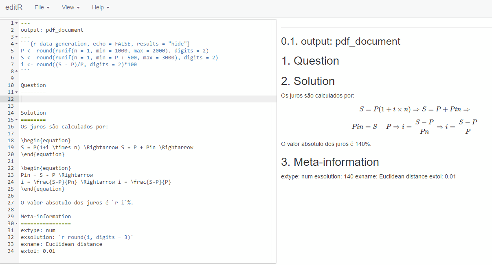
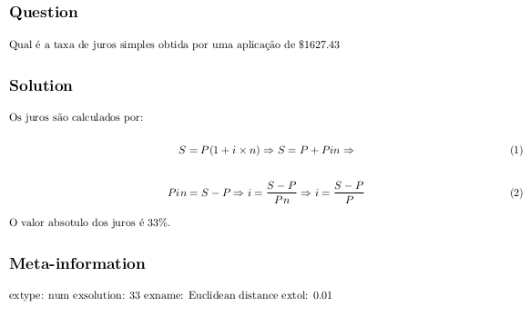

BANCO DE QUESTÕES DE FÍSICA
================

Este é o repositório oficial do banco de questões de Física. Todas as questões devem ser programadas utilizando o pacote [exams](https://cran.r-project.org/web/packages/exams/index.html) do R. Nas próximas seções do documento podem ser encontradas instruções de como contribuir com o repositório.

Diretórios
----------

É importante observar a estrutura de diretórios para contribuição e utilização das questões deste repositório.

-   **Provas**: contém as questões e provas utilizadas em cada semestre.

-   **BancoDeQuestoes**: contém os arquivos .Rnw e .Rmd com as questões, separadas em subpastas, de acordo com o assunto abordado.

-   **Moodle**: contém arquivo .R para criar versões compatíveis com o Moodle. Basta importar os XML gerados dentro do Moodle.

-   **doc**: contém documentações em geral.

Pré-visualização
----------------

Para pré-visualização de questões, pode-se utilizar o arquivo CRIAR-HTML.R, utilizando seu próprio local como [working directory](https://stat.ethz.ch/R-manual/R-devel/library/base/html/getwd.html) no RStudio.

No arquivo CRIAR-HTML.R, para visualizar cada questão, o código é como no exemplo a seguir:

``` r
## Carregando os pacotes necessários
library(tools)
library(exams)

## Definindo a pasta com as questões do exame
myexam <- dir("./BancoDeQuestoes/vm")

## Gerando HTML com o arquivo da questão
set.seed(12017)
exams2html(myexam, n = 1,solution=TRUE,
  encoding = "UTF-8",
  edir = "vm",
  template = "templates/plain.html")
```

Assim, ao criar uma nova questão, você deve incluir um trecho de código como este para que as novas questões adicionadas possam ser facilmente visualizadas.

Colaboração
-----------

Colaboradores do projeto podem colaborar basicamente de duas formas:

1.  Correções em questões já criadas;
2.  Criação de novas questões;

Especialmente o item 2 é importante em virtude de o conjunto de questões disponível ainda ser muito limitado.

### Criando questões

Há ampla documentação sobre o tema na página do pacote [exams](https://cran.r-project.org/web/packages/exams/index.html). Dois artigos em especial contém exemplos e os recursos básicos do pacote:

-   [Automatic Generation of Exams in R](https://cran.r-project.org/web/packages/exams/vignettes/exams.pdf)
-   [Flexible Generation of E-Learning Exams in R: Moodle Quizzes, OLAT Assessments, and Beyond](https://cran.r-project.org/web/packages/exams/vignettes/exams2.pdf)

### Nome das questões

O nome da questão criada deve ser dado da seguinte maneira:

**Qxx[Tipo]Assunto.Rnw**

onde: 

**xx**: número sequencial de implementação: 01, 02, 03, etc.
**Assunto**: Nome abreviado do assunto que se trata a questão. Ex: Ondas, Termd (termodinâmica), CalorTemp (Calor e temperatura), Eletrost (eletrostática), etc. Ex: Q15Eletrost.Rnw
**Tipo**: Inserir a palavra Quiz apenas se a questão for de múltipla escolha ou verdadeiro e falso. Ex: Q02QuizOndas.

Os arquivos .docx do diretório **BancoDeQuestões** possuem questões que estão sendo implementadas. As questões estão separadas por assunto, sendo que no topo de cada assunto possui o nome que deve ser utilizado na questão.

### Acentos

O pacote exams pode apresentar alguns problemas com acentos. Há três soluções:

1. Inserir na questão a seguinte linha de código:

```r
\usepackage[utf8]{inputenc}
```

2. Utilizar acentos em Latex como ```\{c}c``` para ç;
3. Compilar a questão com:

```r
exams2pdf("file.Rmd", encoding = "UTF-8", template = "plain8")
```

### Rnw or Rmd?

Com o pacote exams é possível criar questões tanto em [Sweave](http://www.statistik.lmu.de/~leisch/Sweave/)(.Rnw) quanto em [rmarkdown](http://rmarkdown.rstudio.com/)(Rmd). O Sweave é uma forma de combinar Latex com a linguage R, de forma que codigos e figuras possam ser gerados na linguagem R e embebidos automaticamente no Latex. O rmarkdown, por outro lado, é um pacote mais recente que permite a criaçao de relatórios em [Markdown](https://pt.wikipedia.org/wiki/Markdown), mas que incluem sintaxe em R e em Latex.

Todas as questões disponíveis no repositório, até o momento, foram feitas em Sweave. Ainda assim há vantagens em utilizar o rmarkdown, como:

1.  Sintaxe muito simples;
2.  Preview simplificado;
3.  Edição e visualização em tempo real;

No caso do item 3 é necessário utilizar o pacote [editR](https://github.com/swarm-lab/editR). O pacote referido não se encontra disponivel (ainda) no CRAN, mas pode ser instalado da seguinte forma:

``` r
if (!require("devtools")) install.packages("devtools")
devtools::install_github("trestletech/shinyAce")
devtools::install_github("swarm-lab/editR")

library(editR)
```

Preview:



#### Rmarkdown

A seguir um exemplo simples de uma questão, em rmarkdown, compilável pelo pacote exams:

<pre><code>---
output: pdf_document
---
```{r data generation, echo = FALSE, results = "hide"}
P &lt;- round(runif(n = 1, min = 1000, max = 2000), digits = 2)
S &lt;- round(runif(n = 1, min = P + 500, max = 3000), digits = 2)
i &lt;- round((S - P)/P, digits = 2)*100
```

Question
========
Qual é a taxa de juros simples obtida por uma aplicação de $`r P`

Solution
========
Os juros são calculados por:

\begin{equation}
S = P(1+i \times n) \Rightarrow S = P + Pin \Rightarrow 
\end{equation}

\begin{equation}
Pin = S - P \Rightarrow 
i = \frac{S-P}{Pn} \Rightarrow i = \frac{S-P}{P}
\end{equation}

O valor absotulo dos juros é `r i`%.

Meta-information
================
extype: num
exsolution: `r round(i, digits = 3)`
exname: Euclidean distance
extol: 0.01
</code></pre>



#### Edição em tempo real

A edição em tempo real deve ser feita com a função ```editR()```:

``` r
library(editR)
editR(file = 'my_rmardown_question.Rmd')
```

ATENÇÃO
-------

Este banco de questões pode ser utilizado para gerar versões de uma mesma prova. Caso utilize o banco em uma prova, não disponibilizar as questões e soluções para os alunos. Cada aluno deverá revisar a prova individualmente. Isto é necessário pois o banco de questões não é grande o suficiente.

License
-------

MIT ©
