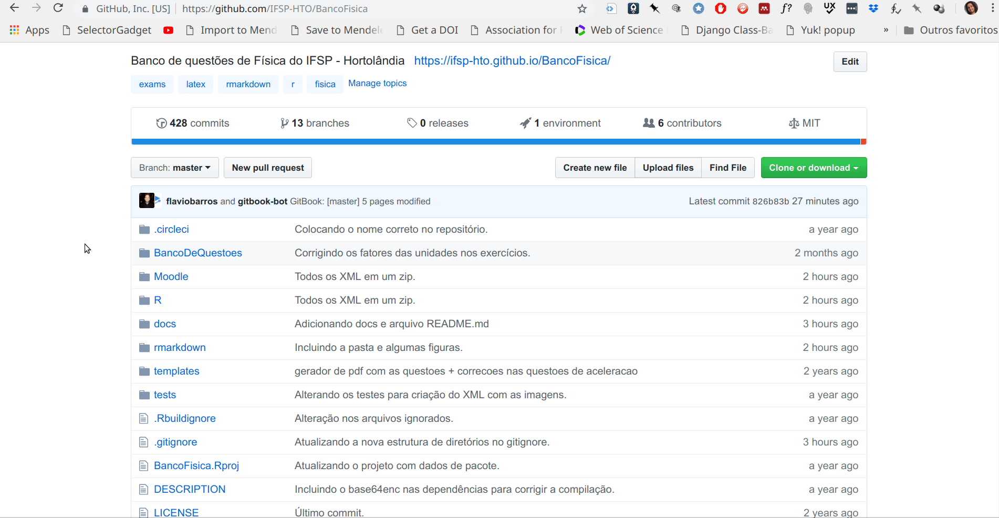
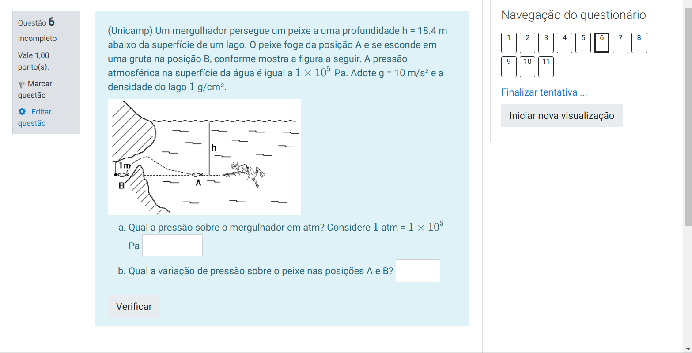

# BancoFísica

[](https://www.gnu.org/licenses/gpl-3.0) [](https://github.com/IFSP-HTO/BancoFisica/actions/workflows/r-tests.yml) [](https://doi.org/10.5281/zenodo.4292534)

## Cite como:
Flavio Barros, Marcelo Cardinali, Carlos E.F. de Santana, jmduly, Vinícius, Logout, & Ana Paula. (2020, November 26). IFSP-HTO/BancoFisica: First release (Version v0.0.1). Zenodo. http://doi.org/10.5281/zenodo.4292534

## Introdução

Este é o repositório oficial do banco de questões de Física produzido pelos professores do IFSP - Câmpus Hortolândia. Todas as questões devem ser programadas utilizando o pacote [exams](http://www.r-exams.org/) do R. Nas próximas seções do documento podem ser encontradas instruções de como contribuir com o repositório.

A seguir você encontra a documentação de como utilizar questões prontas na plataforma Moodle e como contribuir para o projeto.

## Site público

O BancoFisica possui uma vitrine pública em <https://ifsp-hto.github.io/BancoFisica/>.

Esse site apresenta a proposta do projeto, documentação inicial, política de visibilidade e um catálogo de questões demonstrativas. Ele existe para divulgação e orientação pedagógica: a vitrine pública não expõe o banco avaliativo completo, nem promete acesso automático às questões usadas em provas, listas avaliativas, simulados ou questionários reais.

## Panorama do banco de questões

O gráfico abaixo mostra o número de questões por assunto, considerando os arquivos `.Rnw` em `BancoDeQuestoes`. Ele é gerado automaticamente após merges na branch `master`, a partir do estado atual do banco de questões.


Os dados tabulares também são publicados automaticamente em [`question-counts.csv`](https://ifsp-hto.github.io/BancoFisica/question-counts.csv). Pull requests de questões não precisam atualizar o gráfico nem o CSV.

## Quickstart

```text
git clone https://github.com/IFSP-HTO/BancoFisica.git pasta
```

Depois basta entrar na pasta e você encontra o código para todas as questões e o código para geração de PDF e HTML.

### Moodle

Os arquivos Moodle XML são artefatos gerados a partir das questões-fonte em `BancoDeQuestoes/**/*.Rnw`. O pacote estruturado mais recente é criado automaticamente pelo workflow **Moodle XML artifacts** no GitHub Actions e publicado como artifact `moodle-xml-structured`. Em pushes para `master`, o workflow gera 1 variante por questão para manter o artefato rápido; para gerar mais variantes, execute o workflow manualmente e ajuste o campo `variants`.

Para baixar:

1. Acesse a aba [Actions](https://github.com/IFSP-HTO/BancoFisica/actions).
2. Abra a execução mais recente do workflow **Moodle XML artifacts**.
3. Baixe o artifact `moodle-xml-structured`.
4. Descompacte o arquivo e importe no Moodle os XMLs do assunto desejado.

O pacote segue a mesma organização de `BancoDeQuestoes`, gerando um XML por diretório de questões. Por exemplo:

```text
build/moodle-xml
    ├── acel-1.xml
    ├── calorimetria-1.xml
    ├── cinematica
    │   ├── mcu-1.xml
    │   ├── mu-1.xml
    │   └── lancamentos-1.xml
    ├── eletromagnetismo
    │   └── eletrostatica-1.xml
    ├── leisdenewton
    │   └── atrito-1.xml
    ├── manifest.csv
    └── XML.zip
```

O arquivo `manifest.csv` lista o assunto, o diretório-fonte, o XML gerado e a quantidade de questões exportadas. O script usado pelo workflow também pode ser executado localmente:

```text
Rscript tools/generate_moodle_xml.R --seed 1 --n 100 --layout structured --out-dir Moodle/generated --zip --check
```

Os XMLs legados versionados em `Moodle/*.xml` continuam disponíveis no repositório por compatibilidade, mas novas correções devem ser feitas preferencialmente nos `.Rnw` e regeneradas pelo workflow.

#### Baixando



#### Banco de Questões

Uma vez baixadas as questões você pode utilizá-las diretamente no Moodle. Mas para isso você deve importar o XML em um banco de questões. Para exemplificar o processo vamos utilizar o [Moodle Sandbox](https://demo.moodle.net/).


Por fim basta criar um questionário a partir do banco de questões:


Os principais detalhes são: no comportamento da questão você deve selecionar o "feedback imediato" e nas opções de revisão você deve desmarcar todos os "feedbacks".

Por fim, configure o comportamento do questionário.



## Wiki

Mais abaixo fornecemos algumas informações com relação a colaboração mas você pode checar maiores detalhes de como colaborar na nossa [wiki](https://github.com/IFSP-HTO/BancoFisica/wiki). Essa será a principal fonte de documentação do projeto para colaboradores.

## Colaboração

Colaboradores do projeto podem colaborar basicamente de duas formas:

1. Correções de questões já criadas;
2. Criação de novas questões;

Especialmente o item 2 é importante em virtude de o conjunto de questões disponível ainda ser muito limitado.

### Criando questões

Há ampla documentação sobre o tema na página do pacote [exams](https://cran.r-project.org/web/packages/exams/index.html). Dois artigos em especial contêm exemplos e os recursos básicos do pacote:

* [Automatic Generation of Exams in R](https://cran.r-project.org/web/packages/exams/vignettes/exams.pdf)
* [Flexible Generation of E-Learning Exams in R: Moodle Quizzes, OLAT Assessments, and Beyond](https://cran.r-project.org/web/packages/exams/vignettes/exams2.pdf)

#### Pull Request  
[](http://makeapullrequest.com)

Faça um fork do repositório, realize as modificações e faça um pull request. Nós analisaremos a submissão e forneceremos feedback se necessário. Tenha cuidado para que suas contribuições passem nos testes.

#### Issues

Nos issues você pode fazer perguntas, sugerir recursos ou reportar problemas. Sempre que possível utilize os templates disponíveis.

### Nome das questões

O nome da questão criada deve ser dado da seguinte maneira:

**Qxx\[Tipo\]Assunto.Rnw**

onde:

**xx**: número sequencial de implementação: 01, 02, 03, etc.

**Assunto**: nome abreviado do assunto tratado pela questão. Ex.: Ondas, Termd \(termodinâmica\), CalorTemp \(Calor e temperatura\), Eletrost \(eletrostática\), etc. Ex.: Q15Eletrost.Rnw

**Tipo**: inserir a palavra Quiz apenas se a questão for de múltipla escolha ou verdadeiro ou falso. Ex.: Q02QuizOndas.

### Acentos

O pacote exams pode apresentar alguns problemas com acentos. Há três soluções:

1 - Inserir na questão a seguinte linha de código:

```text
\usepackage[utf8]{inputenc}
```

2 - Compilar cada questão com:

```text
exams2pdf("file.Rnw", encoding = "UTF-8", template = "plain8")
```

## ShinyExams

Nós criamos um [addin](https://cran.r-project.org/web/packages/addinslist/README.html) para o RStudio para facilitar a criação de questões. Você pode encontrar maiores informações no [repositório do pacote](https://github.com/flaviobarros/shinyExams).

## Licença

GPL-v3
